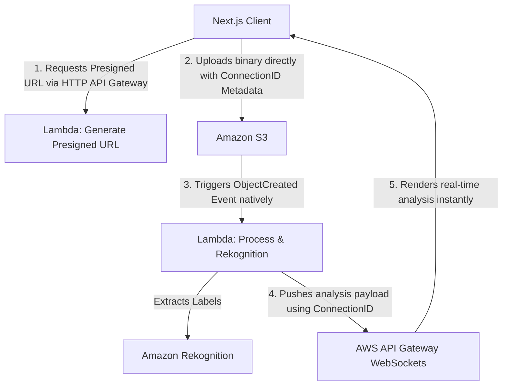

# Vision AI - Event-Driven Serverless Image Analysis System

Vision AI is a production-ready, serverless application that performs real-time image analysis using an event-driven architecture. Built on AWS and Next.js, the system decouples heavy AI processing from the client interface, leveraging WebSockets to deliver instantaneous, asynchronous feedback once images are processed by Amazon Rekognition.

---

## 🏗️ Architectural Overview

The core design principle of this project is **absolute decoupling**. Instead of keeping an HTTP connection open waiting for a heavy image analysis to complete, the system utilizes an asynchronous notification loop.



### The Connection ID Lifecycle

1. When the client loads, it establishes a persistent tunnel via **AWS API Gateway WebSockets**. The `$connect` route stores and sends back a unique `connectionId`.
2. The client requests a secure **S3 Presigned URL**, embedding the environment and `connectionId` directly into the object prefix/key (e.g., `prod#us-east-1_A8x9J.jpg`).
3. Once the payload lands in S3, an event triggers the extraction Lambda. It parses the object key to isolate the `connectionId` dynamically.
4. After fetching labels from **Amazon Rekognition**, the backend targets that specific `connectionId` through the API Gateway Management API, pushing the data over the open WebSocket tunnel.

---

## 🛠️ Tech Stack & Infrastructure

### Frontend & Client
* **Next.js 14 (App Router):** Client interface optimized with managed loading hooks.
* **Tailwind CSS:** Responsive layout designed with alignment structures restricted to a `1400px` max-width viewport.
* **WebSockets API:** Browser-native management for persistent full-duplex communication.

### Cloud Infrastructure (AWS Serverless SDK v3)
* **Amazon S3:** Object storage utilizing fine-grained access through time-restricted presigned write authorizations.
* **AWS Lambda:** Compute layer executing Node.js runtimes under strict modular practices (*tree-shaking* command patterns).
* **Amazon Rekognition:** Computer vision API running object, scene, and concept detection.
* **Amazon API Gateway:** Dual setup running an HTTP API for administrative requests and a WebSocket API for low-latency duplex pipelines.

---

## 🛡️ Cloud Guardrails & FinOps Best Practices

This architecture is optimized to protect the cloud budget and avoid resource starvation:
* **Frontend Payload Validation:** Client-side barriers reject any object exceeding **5MB** or non-image formats (`.jpeg`, `.png`) *before executing* network overhead.
* **Zero-Knowledge Decoupling:** Lambdas resolve their own endpoints dynamically via execution context (`event.requestContext.domainName`), eliminating hardcoded environments and reducing technical debt.
* **Environment Abstraction:** Infrastructure endpoints (Bucket identifiers, API domains, and confidence thresholds) are entirely injected at runtime through `process.env`.

--- 

## 🔧 Local Setup & Environment Variables

### 1. Clone the repository
```bash
git clone https://github.com/AdrianFdz19/vision-cloud-project.git
cd vision-ai
```

### 2. Configure Frontend Variables (`.env.local`)
Create a file in the root of your Next.js project:

```ini
NEXT_PUBLIC_WS_URL=wss://your-websocket-id.execute-api.us-east-1.amazonaws.com
NEXT_PUBLIC_REST_URL=https://your-rest-id.execute-api.us-east-1.amazonaws.com
```

### 3. Configure Backend Variables (AWS Lambda Environment)
Ensure your cloud environment contains the following keys:

* **`S3_BUCKET_NAME`**: For the upload coordinator Lambda.
* **`API_GATEWAY_DOMAIN`**: For the Rekognition processing Lambda (e.g., `id.execute-api.us-east-1.amazonaws.com`).
* **`REKOG_MAX_LABELS`**: Defaults to `10`.
* **`REKOG_MIN_CONFIDENCE`**: Defaults to `75`.

### 4. Run the development environment
```bash
npm install
npm run dev
```

Open [http://localhost:3000](http://localhost:3000) inside your terminal environment to interact with the interface.
